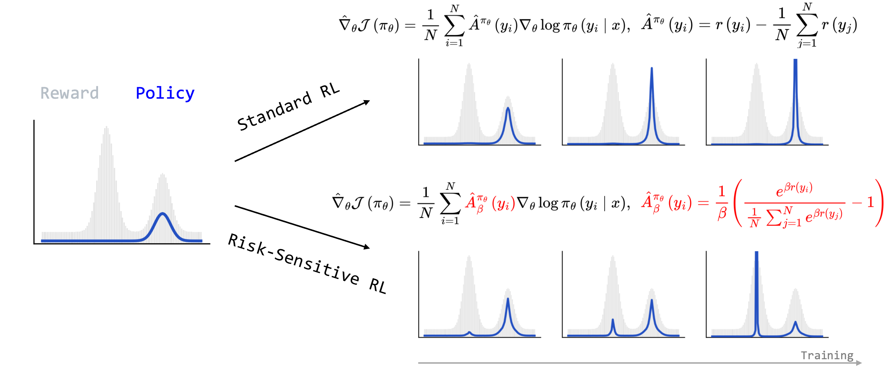
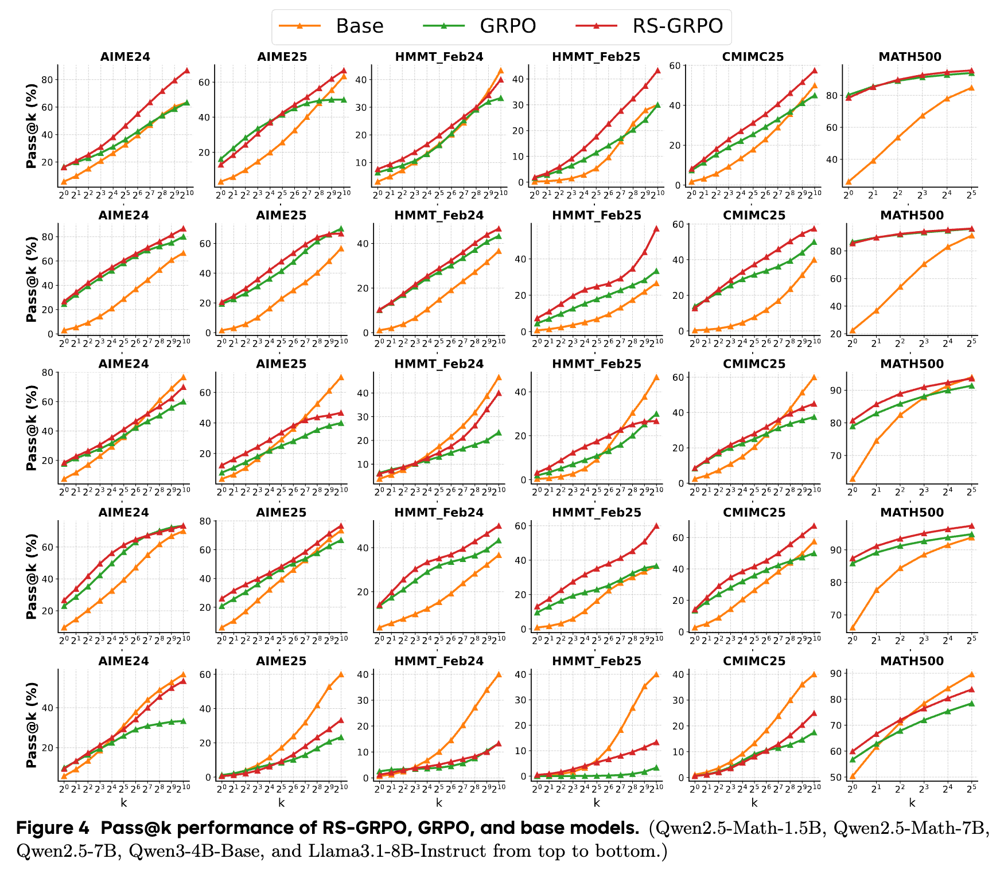

<h1 style="text-align: center;">Risk-Sensitive RL for Alleviating Exploration Dilemmas in Large Language Models</h1>

# Introduction

**Exploration Dilemma:** Current RL methods for LLMs improve pass@1 but hurt pass@k performance. They sharpen the policy distribution around a few solutions, leading to a collapse in solution diversity. This prevents the discovery of novel reasoning strategies.

We argue this dilemma arises from a fundamental mismatch between the optimization landscape of LLMs and the dynamics of standard RL algorithms. **LLMs begin with a highly specialized policy distribution** that is already sharply peaked around certain solutions. If those initial peaks are not supported in the regions that yield optimal rewards, standard RL optimizers face a significant challenge: **they struggle to escape the gravitational pull of the pretrained model's biases and tend to converge to a nearby, but often suboptimal mode**. This prevents the discovery of more diverse and powerful reasoning paths.

# Method 

We introduce a **Risk-Sensitive RL** framework to enhance exploration. Our method, **RS-GRPO**, replaces the standard mean-reward objective with a risk-seeking one with a risk-seeking one that instead **interpolates smoothly between the mean and the maximum reward**.

The **Risk-Sensitive Objective** is defined as:

$$
\mathcal{J}_{\text{RS}}(\pi_\theta) = \mathbb{E}_{x \sim \mathcal{D}} \left[ \frac{1}{\beta} \log \mathbb{E}_{y \sim \pi_\theta(\cdot|x)} \left[ e^{\beta r(y)} \right] \right]
$$

where $\beta \in (0, +\infty)$, controls the risk-sensitivity. 
- As $\beta \rightarrow 0$,  the objective recovers the standard expected reward, $\mathbb{E}[r(y)]$.
- As $\beta \to +\infty$,  the objective approaches the maximum reward, $\max_y r(y)$, encouraging exploration.

The corresponding **Risk-Sensitive Policy Gradient** is:

$$
\nabla_\theta \mathcal{J}_{\text{RS}}(\pi_\theta) = \mathbb{E}_{x, y} \left[ \hat{A}_\beta(y) \nabla_\theta \log \pi_\theta(y \mid x) \right]
$$

with the **Risk-Sensitive Advantage** can be approximated as:

$$
\hat{A}_\beta(y_i) = \frac{1}{\beta} \left(
\frac{ e^{\beta r(y_i)} }
     { \tfrac{1}{N} \sum_{j=1}^N e^{\beta r(y_j)} }
- 1 \right).
$$

A key feature of this formulation is that it only alters the advantage computation while leaving the policy gradient structure intact. This allows our risk-sensitive advantage to serve as a drop-in replacement in existing GRPO-based RL algorithms, requiring only minimal code modifications.

# Why Risk-Sensitive RL is Better？

## Theoretical Perspective
We study the $K$-armed bandit problem. The policy $\pi_\theta$ is a softmax distribution over $K$ actions:

$$
\forall i \in [K],\quad \pi_\theta(a_i) = \frac{e^{\theta_i}}{\sum_{j=1}^K e^{\theta_j}}.
$$

We compare a single policy update for both standard policy gradient and our risk-sensitive policy gradient.

Our analysis reveals a key weakness in the standard policy gradient: it can decrease the probability of the optimal action.

> **Lemma 1:** Standard policy gradient can decrease the probability of the optimal action if a suboptimal action with a reward better than the average exists.

In contrast, our risk-sensitive approach ensures improvement for the optimal action with a sufficiently large risk-sensitivity parameter $\beta$.

> **Lemma 2:** For any policy, the risk-sensitive update increases the probability of the optimal action when $\beta$ is large enough.

These lemmas explain why increasing $\beta$ helps escape local optima and highlight the theoretical advantages of risk-sensitive policy gradients.

More details can be found in the paper.

## Empirical Perspective

A bandit experiment demonstrating that risk-sensitive RL can escape a local optimum that traps its standard RL counterpart.
- **Left:** The reward landscape shows a global optimum and a distinct local optimum where the policy is initialized. 
- **Right:** A standard risk-neutral policy ($\beta=0$) is trapped locally, while risk-sensitive policies ($\beta \geq 4$) converge to the global optimum.

# Results Highlight

RS-GRPO consistently improves pass@k performance over and the standard GRPO algorithm across six mathematical reasoning benchmarks and five LLMs.

The table provides a more comprehensive evaluation, covering five base models and three training datasets (math12k, deepmath103k, dapo17k). RS-GRPO consistently improves pass@k performance over standard GRPO algorithm. While many pass@k-oriented methods fail to improve pass@1 over GRPO, RS-GRPO achieves at least comparable Pass@1 performance and exceeds GRPO by an average of about 2\% across three models (Qwen2.5-7B-Math, Qwen2.5-7B, Qwen3-4B).

We recommend setting $\beta=2$, which achieves a good trade-off between pass@k and pass@1 performance in our experiments.

<!-- # Citation
If you find our work useful, please cite our paper:

@article{jiang2025riskrl,
  title={Risk-Sensitive RL for Alleviating Exploration Dilemmas in Large Language Models},
  journal={arXiv preprint arXiv:2506.10406},
  year={2025}   
} -->